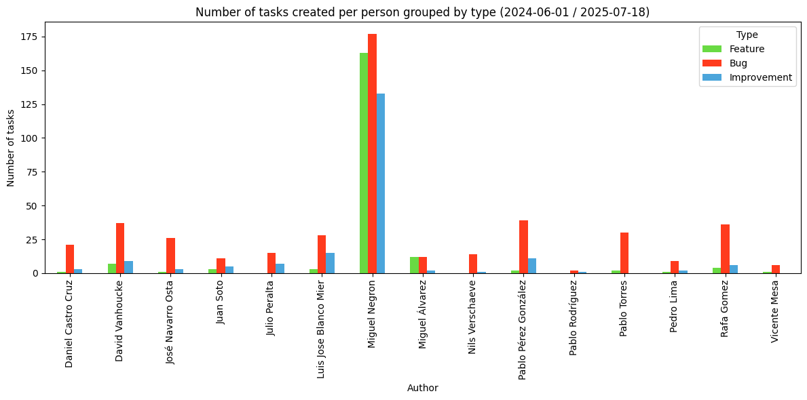

# Redborder Wrapped

Redborder Wrapped is a Python tool designed to automate the extraction and reporting of issues from a Product NG project.

## 📊 Output Examples

All generated data (charts and CSV files) will be exported to the `data` folder.

### Chart Example



### Generated CSV Example

| Name                    | Feature | Bug | Improvement |
|-------------------------|---------|-----|-------------|
| Daniel Castro Cruz      | 1       | 21  | 3           |
| David Vanhoucke         | 7       | 37  | 9           |
| José Navarro Osta       | 1       | 26  | 3           |
| Juan Soto               | 3       | 11  | 5           |
| Julio Peralta           | 0       | 15  | 7           |
| Luis Jose Blanco Mier   | 3       | 28  | 15          |
| Miguel Negron           | 163     | 177 | 133         |
| Miguel Álvarez          | 12      | 12  | 2           |
| Nils Verschaeve         | 0       | 14  | 1           |
| Pablo Pérez González    | 2       | 39  | 11          |
| Pablo Rodríguez         | 0       | 2   | 1           |
| Pablo Torres            | 2       | 30  | 0           |
| Pedro Lima              | 1       | 9   | 2           |
| Rafa Gomez              | 4       | 36  | 6           |
| Vicente Mesa            | 1       | 6   | 0           |

## 🧰 Installation Guide (Python 3.12)

Set up the project easily on **macOS, Linux, or Windows** using Python 3.12.

---

### 1️⃣ Check Python 3.12 Installation

Verify your Python version:

```sh
python3 --version
```

If Python 3.12 is not installed, download it from the [official Python website](https://www.python.org/downloads/).

---

### 2️⃣ Create & Activate a Virtual Environment

**macOS & Linux:**

```sh
python3.12 -m venv venv
source venv/bin/activate
```

**Windows (Command Prompt):**

```sh
python -m venv venv
venv\Scripts\activate
```

---

### 3️⃣ Install Dependencies

With the virtual environment activated, run:

```sh
pip install --upgrade pip
pip install -r requirements.txt
```

---

## 🔑 Set up Redmine API

### 1️⃣ Create a `.env` File

Create a `.env` file in the project root to store your Redmine API key:

```sh
echo "REDMINE_API_KEY=your_api_key_here" > .env
```

Replace `your_api_key_here` with your actual Redmine API key.

> **Note:** Never commit your `.env` file to version control.

---

## 📅 Set the Date Range for Issue Filtering

Specify the start and end dates to filter issues by their creation date. Update the values as needed:

```python
START_TIME = datetime.strptime('2025-01-01', '%Y-%m-%d')
END_TIME = datetime.strptime('2025-07-18', '%Y-%m-%d')
```

> **Tip:** Adjust the dates to match your desired reporting period.
